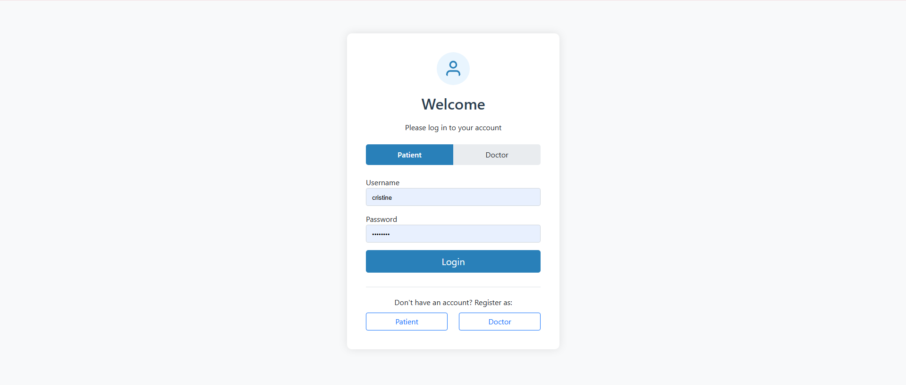
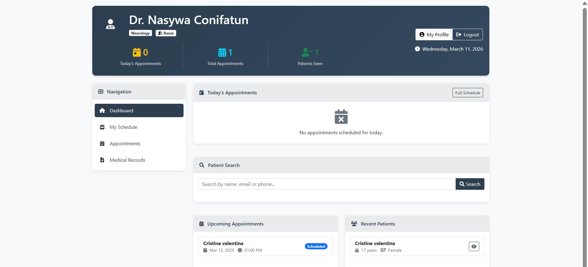
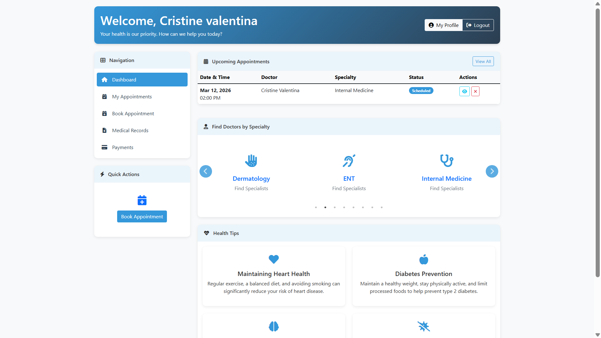
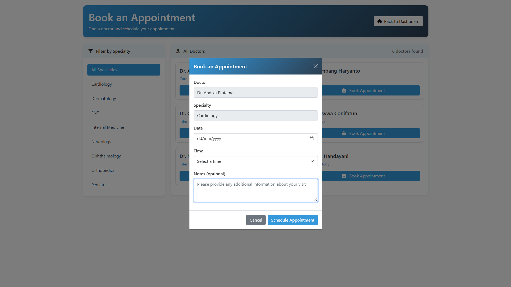
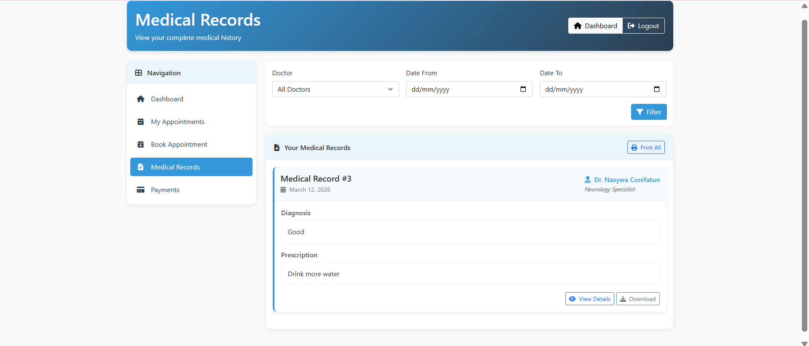

# Hospital Management System

A simple **web-based Hospital Management System** built using **PHP and MySQL**.
This system allows doctors and patients to manage appointments, medical records, and basic hospital operations through a web interface.

---

## Features

* User authentication (login system)
* Doctor registration
* Patient registration
* Doctor dashboard
* Patient dashboard
* Appointment booking system
* Medical records management
* Payment management

---

## Tech Stack

Frontend
HTML
CSS
JavaScript

Backend
PHP

Database
MySQL

Environment
XAMPP (Apache + MySQL)

---

## Installation Guide

### 1. Clone the repository

git clone https://github.com/tintinbunyispeda/hospital-management-system.git

### 2. Move project to XAMPP htdocs

Example path:

C:\xampp\htdocs\hospital-management-system

### 3. Start XAMPP

Start these services:

Apache
MySQL

### 4. Import database

1. Open phpMyAdmin
2. Create database:

hospital_db

3. Import the file:

db.sql

### 5. Configure database connection

Open file:

config.php

Example configuration:

$conn = mysqli_connect("localhost","root","","hospital_db");

### 6. Run the project

Open browser:

http://localhost/hospital-management-system/login.php

---

## Screenshots

### Login Page

### Doctor Dashboard

### Patient Dashboard

### Appointment System

### Medical Records

---

## Project Structure

hospital-management-system
│
├── Screenshots
│   ├── login.png
│   ├── doctor-dashboard.png
│   ├── patient-dashboard.png
│   ├── appointments.png
│   └── medical-records.png
│
├── login.php
├── register_doctor.php
├── register_patient.php
├── appointments.php
├── medical_records.php
├── payments.php
├── config.php
├── db.sql
└── README.md

---

## Future Improvements

* Improve UI design
* Add role-based authentication
* Add appointment calendar
* Convert frontend to React
* Add REST API backend

---

## Author
 Cristine Valentina
